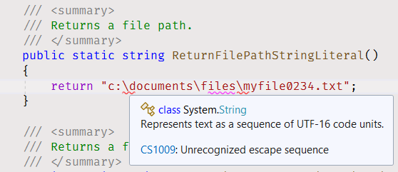
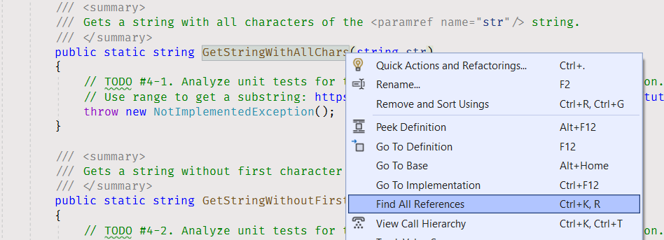
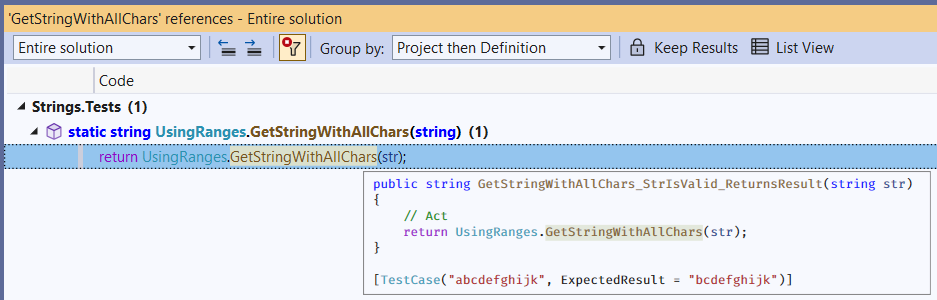

# Strings

Beginner level task for practicing string manipulations.


## Task Description

### 1. String Literals

In the [StringLiterals.cs](Strings/StringLiterals.cs) file you have to implement seven methods returning string literals.

| Method Name                          | Returned String                             | Is Verbatim  |
|--------------------------------------|---------------------------------------------|--------------|
| ReturnAbcStringLiteral               | abc                                         | No           |
| ReturnAbcdefStringLiteral            | ABCDEF                                      | No           |
| ReturnEmptyString                    |                                             | No           |
| ReturnFilePathStringLiteral1         | c:\documents\files\myfile0234.txt           | No           |
| ReturnFilePathStringLiteral2         | c:\users\myuser\documents\my-video-file.avi | No           |
| ReturnFilePathVerbatimStringLiteral1 | c:\documents\files\datafile0582.txt         | Yes          |
| ReturnFilePathVerbatimStringLiteral2 | c:\users\myuser\documents\my-audio-file.mp3 | Yes          |

In the [ReturnAbcStringLiteral](Strings/StringLiterals.cs#L11) return a string literal "abc".

```cs
public static string ReturnAbcStringLiteral()
{
    return "abc";
}
```

Return a string literal "ABCDEF" in the [ReturnAbcdefStringLiteral](Strings/StringLiterals.cs#L20) method.

Sometimes you have to use empty string literal in your code. For such cases the [String class](https://docs.microsoft.com/en-us/dotnet/api/system.string) has a [special static field called Empty](https://docs.microsoft.com/en-us/dotnet/api/system.string.empty).

Return the empty string from the [ReturnEmptyString](Strings/StringLiterals.cs#L29) method.

```cs
public static string ReturnEmptyString()
{
    return string.Empty;
}
```

A [backslash character](https://en.wikipedia.org/wiki/Backslash) is used on Windows systems to separate the directories in the files paths.

Try to return the "c:\documents\files\myfile0234.txt" file path from the [ReturnFilePathStringLiteral1](Strings/StringLiterals.cs#L39) method.

```cs
public static string ReturnFilePathStringLiteral1()
{
    return "c:\documents\files\myfile0234.txt";
}
```

You will get an [CS1009 compiler error](https://docs.microsoft.com/en-us/dotnet/csharp/language-reference/compiler-messages/cs1009).



Backslash characters are used to designate an [escape sequence](https://docs.microsoft.com/en-us/dotnet/csharp/programming-guide/strings/#string-escape-sequences) in C# strings. Therefore you have to use the '\\' escape sequence to specify a backslash.

```cs
public static string ReturnFilePathStringLiteral1()
{
    return "c:\\documents\\files\\myfile0234.txt";
}
```

Return the "c:\users\myuser\documents\my-video-file.avi" file path from the [ReturnFilePathStringLiteral2](Strings/StringLiterals.cs#L48) method.

You can use a [verbatim string literal](https://docs.microsoft.com/en-us/dotnet/csharp/language-reference/tokens/verbatim) to avoid having escape sequences in your file path strings.

Return the "c:\documents\files\datafile0582.txt" verbatim string literal from the [ReturnFilePathVerbatimStringLiteral1](Strings/StringLiterals.cs#L57) method.

```cs
public static string ReturnFilePathVerbatimStringLiteral1()
{
    return @"c:\documents\files\datafile0582.txt";
}
```

The `@` special character is used here to indicate that a string literal is to be interpreted verbatim.

Return the "c:\users\myuser\documents\my-audio-file.mp3" verbatim string literal from the [ReturnFilePathVerbatimStringLiteral2](Strings/StringLiterals.cs#L67) method.


### 2. Accessing Array Elements

In the [GetFirstChar](Strings/UsingIndexer.cs#L8) method return the first character of the `str`.

```cs
public static char GetFirstChar(string str)
{
    return str[0];
}
```

In the [GetLastCharUsingLength](Strings/UsingIndexer.cs#L88) method return the last string element.

```cs
public static char GetLastCharUsingLength(string str)
{
    return str[str.Length - 1];
}
```

The [String.Length](https://docs.microsoft.com/en-us/dotnet/api/system.string.length) property returns a string length.

In the [GetLastChar](Strings/UsingIndexer.cs#L38) method return the last character of the `str` using [index from end operator ^](https://docs.microsoft.com/en-us/dotnet/csharp/tutorials/ranges-indexes).

```cs
public static char GetLastChar(string str)
{
    return str[^1];
}
```

Implement all static methods in the [UsingIndexer.cs](Strings/UsingIndexer.cs) file. See the method documentation and TODO comments.


### 3. Ranges

[Ranges](https://docs.microsoft.com/en-us/dotnet/csharp/whats-new/tutorials/ranges-indexes) is a feature added in C# 8 that allows to get a subrange of an array.

Go to the [GetStringWithAllChars](Strings/UsingRanges.cs#L10) method.

```cs
public static string GetStringWithAllChars(string str)
{
    // TODO #4-1. Analyze unit tests for the method, and add the method implementation.
    // Use range to get a substring: https://docs.microsoft.com/en-us/dotnet/csharp/tutorials/ranges-indexes
    throw new NotImplementedException();
}
```

[Find all references](https://docs.microsoft.com/en-us/visualstudio/ide/finding-references) of the `GetStringWithAllChars` method in your solution.



In the result window click on the method name, thus you will navigate to a unit test that references the `GetStringWithAllChars` method.



The `GetStringWithAllChars_StrIsValid_ReturnsResult` unit test has two [TestCase attributes](https://docs.nunit.org/articles/nunit/writing-tests/attributes/testcase.html). Each attribute describes a test situation (test case). The first attribute parameter is `str` value that gets to the unit test, and the second attribute parameter contains an expected result that the unit test should return.

```cs
[TestCase("", ExpectedResult = "")]
[TestCase("abcdefghijk", ExpectedResult = "abcdefghijk")]
public string GetStringWithAllChars_StrIsValid_ReturnsResult(string str)
{
    // Act
    return UsingRanges.GetStringWithAllChars(str);
}
```

For this unit test there are two test cases:
* The unit test should return an empty string, if the `str` is an empty string.
* The unit test should return "abcdefghijk" string, if the `str` is "abcdefghijk" string.

To fulfill these requirements implement the `GetStringWithAllChars` method using the [range operator ..](https://docs.microsoft.com/en-us/dotnet/csharp/language-reference/proposals/csharp-8.0/ranges#systemrange).

```cs
public static string GetStringWithAllChars(string str)
{
    return str[0..^0];
}
```

The range operator has two operands. In this case these operands can be omitted:

```cs
public static string GetStringWithAllChars(string str)
{
    return str[..];
}
```

The `String` class has the [String.Substring](https://docs.microsoft.com/en-us/dotnet/api/system.string.substring) method that retrieves a substring from a string instance. The ranges in C# for strings are translated as `String.Substring` calls. The `GetStringWithAllChars` method will be translated as:

```cs
public static string GetStringWithAllChars(string str)
{
    return str.Substring(0, str.Length);
}
```

Implement all static methods in the [UsingRanges.cs](Strings/UsingRanges.cs) file. See the method documentation and TODO comments.


### 4. Creating Strings

In the [ReturnNewString](Strings/CreatingStrings.cs#L10) method create a new string from a `str` string using the [new operator](https://docs.microsoft.com/en-us/dotnet/csharp/language-reference/operators/new-operator).

```cs
public static string ReturnNewString(string str)
{
    return new string(str);
}
```

The [String class](https://docs.microsoft.com/en-us/dotnet/api/system.string) has a [number of constructors](https://docs.microsoft.com/en-us/dotnet/api/system.string.-ctor) allowing to create new strings based on a certain rules.

In the [ReturnStringWithRepeatedChars](Strings/CreatingStrings.cs#L20) method return a new string that has `count` characters and all of these characters are `c`.

```cs
public static string ReturnStringWithRepeatedChars(char c, int count)
{
    return new string(c, count);
}
```

Implement all static methods in the [CreatingStrings.cs](Strings/CreatingStrings.cs) file. See the method documentation and TODO comments.


### 5. Concatenation

[Concatenation](https://docs.microsoft.com/en-us/dotnet/csharp/how-to/concatenate-multiple-strings) is an operation of appending one string to the end of another string.

In the [ConcatenateTwoStrings1](Strings/Concatenation.cs#L10) method [concatenate strings using + operator](https://docs.microsoft.com/en-us/dotnet/csharp/how-to/concatenate-multiple-strings#-and--operators).

```cs
public static string ConcatenateTwoStrings1(string s1, string s2)
{
    return s1 + s2;
}
```

In the [ConcatenateTwoStrings2](Strings/Concatenation.cs#L40) method [concatenate strings using String.Concat](https://docs.microsoft.com/en-us/dotnet/csharp/how-to/concatenate-multiple-strings#stringconcat-or-stringjoin) method.

```cs
public static string ConcatenateTwoStrings2(string s1, string s2)
{
    return string.Concat(s1, s2);
}
```

The operator + concatenate strings using the [String.Concat method](https://docs.microsoft.com/en-us/dotnet/api/system.string.concat) under the hood.

The `String.Concat` method has overloads that allow to convert object arguments to strings and concatenate them.

```cs
public static string ConcatenateValues(string str, int intValue, long longValue)
{
    return string.Concat(str, intValue, longValue);
}
```

Also, the `String.Concat` method has overloads that support collections that can be enumerated.

```cs
public static string ConcatenateStrings(IEnumerable<string> strings)
{
    return string.Concat(strings);
}
```

Implement all static methods in the [Concatenation.cs](Strings/Concatenation.cs) file. See the method documentation and TODO comments.


### 6. Joining Strings

The [String.Join](https://docs.microsoft.com/en-us/dotnet/api/system.string.join) method concatenates the elements of a specified array or the members of a collection, using the specified separator between each element or member.

Use the `String.Join` method to concatenate the array elements in the [GetCommaSeparatedString](Strings/JoiningStrings.cs#L10) method.

```cs
public static string GetCommaSeparatedString(string[] values)
{
    return string.Join(',', values);
}
```

Implement all static methods in the [JoiningStrings.cs](Strings/JoiningStrings.cs) file. See the method documentation and TODO comments.


### 7. Splitting Strings

The [String.Split](https://docs.microsoft.com/en-us/dotnet/api/system.string.split) method returns a string array that contains the substrings in this instance that are delimited by elements of a specified string.

Use the `String.Split` method to split a string to substrings in the [SplitCommaSeparatedString](Strings/SplittingStrings.cs#L10) method.

```cs
public static string[] SplitCommaSeparatedString(string str)
{
    return str.Split(',');
}
```

Implement all static methods in the [SplittingStrings.cs](Strings/SplittingStrings.cs) file. See the method documentation and TODO comments.


### 8. String Manipulations

Strings in .NET are *immutable*, that means a new string is created each time you edit a string. That's why the `String` class methods that change a string content return a new string as a return parameter.

```cs
public string Insert (int startIndex, string value);
```

The [String.Insert](https://docs.microsoft.com/en-us/dotnet/api/system.string.insert) method has a return parameter of the *string* type - the method returns a new string after an insert operation.

In the [GetHelloGreeting1](Strings/Manipulations.cs#L10) method return the greeting phrase using the `String.Insert` method to insert a name to the predefined template string.

```cs
public static string GetHelloGreeting1(string name)
{
    const string template = "Hello, !";
    return template.Insert(7, name);
}
```

In the [GetHelloGreeting2](Strings/Manipulations.cs#L30) method use the [String.Trim](https://docs.microsoft.com/en-us/dotnet/api/system.string.trim) method to remove all leading and trailing space characters from the `name` argument.

```cs
public static string GetHelloGreeting2(string name)
{
    const string template = "Hello, !";
    return template.Insert(7, name.Trim());
}
```

In the [GetHelloGreeting3](Strings/Manipulations.cs#L50) method use the [String.Replace](https://docs.microsoft.com/en-us/dotnet/api/system.string.replace) method to replace the name token in the template string with the `name` argument.

```cs
public static string GetHelloGreeting3(string template, string name)
{
    return template.Replace("{name}", name, StringComparison.InvariantCulture);
}
```

In the [GetRefinedCode](Strings/Manipulations.cs#L70) method use the [String.Remove](https://docs.microsoft.com/en-us/dotnet/api/system.string.remove) method to remove a substring from the `code` argument.

```cs
public static string GetRefinedCode(string code)
{
    return code.Remove(3, 3);
}
```

Implement all static methods in the [Manipulations.cs](Strings/Manipulations.cs) file. See the method documentation and TODO comments.


### 9. String Interpolation

An [interpolated string](https://docs.microsoft.com/en-us/dotnet/csharp/language-reference/tokens/interpolated) is a string literal that might contain *interpolation expressions*. When an interpolated string is resolved to a result string, items with interpolation expressions are replaced by the string representations of the expression results.

In the [GetHelloGreeting](Strings/Interpolation.cs#L10) method use an interpolated string to concatenate a greeting phrase.

```cs
public static string GetHelloGreeting(string name)
{
    return $"Hello, {name}!";
}
```

An interpolated expression can be not only a parameter name, but also a C# language construction. Add the power of `i` to a interpolated string in the [GetSequenceOfNumbers](Strings/Interpolation.cs#L30) method.

```cs
public static string GetSquareNumber(int i)
{
    return $"The square number of {i} is {i * i}.";
}
```

In the [GetSequenceOfNumbers](Strings/Interpolation.cs#L50) method to include braces, "{" and "}", in the text produced by an interpolated string, [use two braces](https://docs.microsoft.com/en-us/dotnet/csharp/language-reference/tokens/interpolated#special-characters), "{{" and "}}".

```cs
public static string GetSequenceOfNumbers(int[] numbers)
{
    return $"The sequence is {{{string.Join(',', numbers)}}}.";
}
```

In the [GetDocumentPath](Strings/Interpolation.cs#L70) method use the *interpolated verbatim literal* to concatenate a file path to a document:

```cs
public static string GetDocumentPath(string username, string filename, string extension)
{
    return $@"c:\users\{username}\Documents\{filename}.{extension}";
}
```

Implement all static methods in the [Interpolation.cs](Strings/Interpolation.cs) file. See the method documentation and TODO comments.


### 10. Copying String Characters

In the [CopyOneChar](Strings/CopyingStrings.cs#L10) method use the [String.ToCharArray](https://docs.microsoft.com/en-us/dotnet/api/system.string.tochararray) method to transform a string to an array of characters and then copy the `source` string characters to the beginning of the `destination` array by using the [String.CopyTo](https://docs.microsoft.com/en-us/dotnet/api/system.string.copyto) method.

```cs
public static string CopyOneChar(string source, string destination)
{
    char[] destinationArray = destination.ToCharArray();
    source.CopyTo(0, destinationArray, 4, source.Length);
    return new string(destinationArray);
}
```

Implement all static methods in the [CopyingStrings.cs](Strings/CopyingStrings.cs) file. See the method documentation and TODO comments.


## Fix Compiler Issues

Additional style and code checks are enabled for the projects in this solution to help you maintaining consistency of the project source code and avoiding silly mistakes. [Review the Error List](https://docs.microsoft.com/en-us/visualstudio/ide/find-and-fix-code-errors#review-the-error-list) in Visual Studio to see all compiler warnings and errors.

If a compiler error or warning message is not clear, [review errors details](https://docs.microsoft.com/en-us/visualstudio/ide/find-and-fix-code-errors#review-errors-in-detail) or google the error or warning code to get more information about the issue.


## Task Checklist

1. Rebuild the solution.
1. Fix all compiler warnings and errors.
1. Run all unit tests, make sure all unit tests completed successfully.
1. Review all changes, make sure the only code files (.cs) in Strings project have changes. No changes in project files (.csproj) or in Strings.Tests project.
1. Stage your changes, and create a commit.
1. Push your changes to remote repository.


## See also

* Tutorials
  * [Indices and ranges](https://docs.microsoft.com/en-us/dotnet/csharp/tutorials/ranges-indexes)
* What's new in C# 8.0
  * [Indices and ranges](https://docs.microsoft.com/en-us/dotnet/csharp/whats-new/csharp-8#indices-and-ranges)
* C# Programming Guide
  * [Strings](https://docs.microsoft.com/en-us/dotnet/csharp/programming-guide/strings/)
* C# Reference
  * [@](https://docs.microsoft.com/en-us/dotnet/csharp/language-reference/tokens/verbatim)
* .NET Guide
  * [Best Practices for Using Strings in .NET](https://docs.microsoft.com/en-us/dotnet/standard/base-types/best-practices-strings)
* .NET API
  * [String Class](https://docs.microsoft.com/en-us/dotnet/api/system.string)
